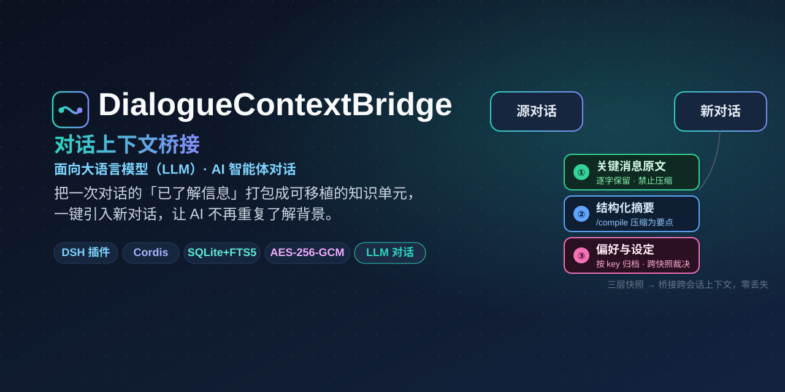
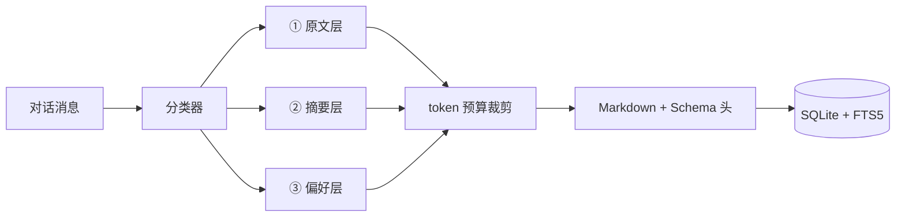
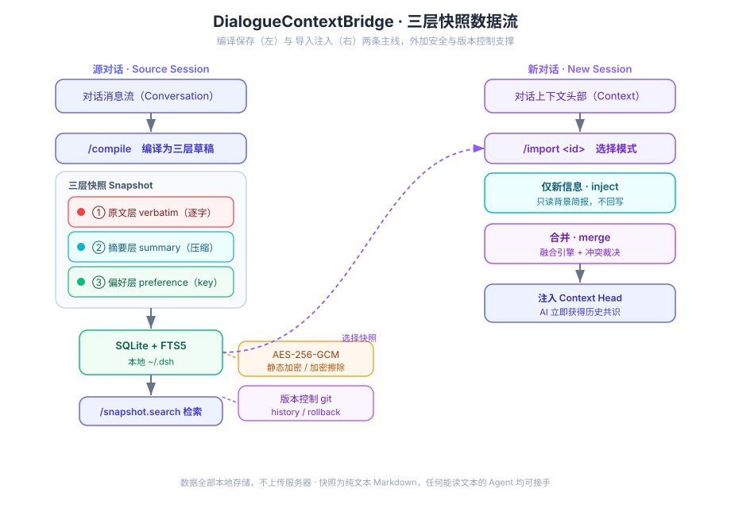

# DialogueContextBridge · 对话上下文桥接

> **为大语言模型（LLM）与 AI 智能体的对话会话做跨会话上下文桥接。**
>
> 把一次对话里「已经了解的信息」打包成可移植的知识单元，一键引入新对话，让 AI 不必反复从头了解背景。

<p>
  
</p>

| 资源 | 链接 |
| --- | --- |
| 📖 文档站点 | [shadowquill.github.io/DialogueContextBridge](https://shadowquill.github.io/DialogueContextBridge/) |
| 架构设计 | [docs/architecture.md](https://github.com/ShadowQuill/DialogueContextBridge/blob/main/docs/architecture.md) |
| 快照格式 | [docs/snapshot-schema.md](https://github.com/ShadowQuill/DialogueContextBridge/blob/main/docs/snapshot-schema.md) |
| 宿主联调 | [docs/dsh-host-integration.md](https://github.com/ShadowQuill/DialogueContextBridge/blob/main/docs/dsh-host-integration.md) |

[](https://github.com/ShadowQuill/DialogueContextBridge/actions/workflows/ci.yml)
[](https://github.com/ShadowQuill/DialogueContextBridge/actions/workflows/deploy-docs.yml)
[](./LICENSE)
[](https://shadowquill.github.io/DialogueContextBridge/)
[](https://github.com/ShadowQuill/DialogueContextBridge/releases)
[](https://github.com/ShadowQuill/dsh)

> **状态**：✅ `v0.2.0` 已发布 · `0.3.0` 开发中 · 真实 `dsh@0.1.1-rc.2` 宿主端到端验证通过 · CI 绿 · 104 单测 · 文档站自动部署

## 这是什么

做长周期项目（软件开发、学术研究、产品设计）时，你和大语言模型（LLM）/ AI 智能体的工作往往跨越多个对话会话。每开一个新对话，模型都「失忆」，要重新解释一遍背景，于是出现三个老问题：

- **效率低**：反复手动复制粘贴历史上下文；
- **信息丢**：关键决策、代码、参数在摘要里被磨平；
- **体验断**：长期项目的连续性被会话边界切断。

DialogueContextBridge 是一个 **DSH（DeepSeek Harness，一个面向大语言模型的智能体运行时）插件**，用「对话上下文快照」解决这件事：在源对话里 `/compile` + `/save`，在新对话里一键引入，AI 立刻拿到你们此前达成的全部共识。

所有数据只存在本机 `~/.dsh/`，不上传任何服务器；快照是纯文本 Markdown，任何能读文本的 Agent 都能接手。

## 核心设计：三层快照

快照不是对话日志的转储，而是一个结构化的三层复合体。

| 层 | 内容 | 处理策略 |
| --- | --- | --- |
| **① 关键消息原文** | 最终敲定的代码、决策结论、技术参数、硬性指令 | **逐字保留**，禁止压缩与截断 |
| **② 结构化摘要** | 讨论背景、推导过程、中间试错、已排除方案 | 由 `/compile` 压缩为分层要点（内置抽取式，或 `summary.mode=llm` 走宿主 LLM） |
| **③ 用户偏好与设定** | 风格偏好、角色设定、项目硬性约束 | 按稳定 `key` 归档，便于跨快照裁决 |

这个分层是为了解决「摘要损失」：把不可压缩的东西和可压缩的东西分开处理，而不是对整段对话做一次无差别摘要。





## 快速开始

### 环境要求

- Node.js ≥ 20（better-sqlite3@11 运行时要求；CI 矩阵为 20.x / 22.x）
- 一个基于 Cordis 的 DSH 运行时
- SQLite ≥ 3.34（用于 FTS5 `trigram` 分词器，中文检索依赖它；低版本会自动回退到 `unicode61`）

### 安装

```bash
# 在 DSH 工作目录中安装
npm install dsh-plugin-dialogue-context-bridge
```

### 启用插件

在 DSH 配置中加载插件，或在设置面板中搜索「对话上下文桥接」启用：

```ts
import bridge from 'dsh-plugin-dialogue-context-bridge';

ctx.plugin(bridge, {
  maxTokens: 4096,
  autoSave: false,
});
```

### 三条命令跑通闭环

```bash
# 1. 把当前对话编译为快照草稿（只在内存中，不写盘）
/compile --title "上下文桥接架构评审" --tags 架构,phase1

# 2. 确认无误后落库
/save

# 3. 在任何时候按关键词找回它
/snapshot-search 上下文桥接

# 4. 在新对话里一键引入——默认「仅新信息」模式（只读背景，不回写）
/import snap_a1b2c3

#    想让当前对话与历史快照融合？用 merge 模式（Phase 3 基线）
/import snap_a1b2c3 --mode merge

#    只看简报、不注入，先确认内容对不对
/import snap_a1b2c3 --dry-run
```

### 跨设备 / 跨账号迁移记忆（文件导入导出）

快照文档是纯文本 Markdown + 自描述 Schema 头，可脱离本插件独立存在。导出为文件后，
拷贝到另一台机器或账号，再用 `/dcb-import` 接手——这就是 spec 要求的「可迁移性」超越
聊天内复制粘贴的形态。

```bash
# 导出单条快照为 .md 文件（默认落 <数据目录>/exports/）
/dcb-export snap_a1b2c3

# 导出全部快照
/dcb-export --all

# 指定导出目录
/dcb-export --all -o ~/Desktop/my-snapshots

# 先预览、不落库：解析并校验文件，确认内容对不对
/dcb-import ~/Desktop/my-snapshots/snap_a1b2c3__xxx.md --dry-run

# 导入到记忆库（自动分配新 id，绝不覆盖本地已有快照）
/dcb-import ~/Desktop/my-snapshots/snap_a1b2c3__xxx.md
```

导入后会生成新 id（避免与本地或其他来源的相同 id 冲突覆盖），正文校验和重算后写回；
目标库若开启加密，导入内容会按本地策略重新加密落盘。

### 打开 Web UI

```bash
dsh --profile web          # 启动并自动打开默认浏览器到 Web UI
# 后台运行且不自动开浏览器： dsh --profile web --no-open
```

插件加载后，在对话里输入 `/dcb` 会返回一张**「记忆库总览」卡片**（近期快照表 + 一键操作清单）；它同时也是**功能导航主页**，列出全部命令的中文速查。所有命令都可在输入框按 `/`（或点菜单按钮）唤起**命令面板**，鼠标点选即执行，走宿主、不经模型、零 token——无需手打命令。命令回执统一为**纯文本卡片**（emoji 标题 + `·` 项目符号 + `→` 引导 + `─` 分隔线，DSH 命令回执不解析 Markdown，故不用任何标记符号）。

> **手打命令也会被宿主拦截**：每个命令都声明了 `input` 输入提示符，因此即使在输入框**手打整条带参命令**（如 `/dcb-merge snap_a1b2c3 --policy newWins`）再回车，也会由宿主直接执行、不会当作聊天发给模型——从根上避免历史 `/import ... --mode merge` 被模型当成对话、烧 token 的问题。菜单点选与手打命令**同样会被拦截执行、不再误发模型**；但需注意：DSH 0.1.x rc.2 下**手打带参命令**的气泡会常驻「执行中…」（结果已注入，发一条新消息即清），而**菜单点选或无参命令无此现象**（详见下文「已知限制」）。为免手打带参，本插件另提供 `/dcb-import-last` / `/dcb-merge-last` 两个**无参命令**，命令面板点选即执行、零手打、零气泡。

## 命令参考

| 命令 | 说明 | 常用选项 |
| --- | --- | --- |
| `/compile` | 编译当前对话为三层快照草稿并预览 | `--title` `--tags` `--max-tokens` `--full` `--discard` |
| `/save` | 把草稿写入本地记忆库；无草稿时即时编译并保存 | `--title` `--tags` `--max-tokens` |
| `/snapshot-search <keywords>` | FTS5 全文检索（多关键词为 AND 语义） | `-n, --limit` |
| `/snapshot-list` | 列出快照 | `-n, --limit` `--here` |
| `/snapshot-show <id>` | 查看快照完整文档与完整性校验结果 | `--meta` |
| `/snapshot-remove <id>` | 删除快照及其索引（不可撤销） | — |
| `/snapshot-history <id>` | 查看快照版本历史（Phase 4 版本控制） | — |
| `/snapshot-rollback <id>` | 回滚快照到历史版本并重新落库 | `--to <ref>` |
| `/snapshot-weight <id> [<n>]` | 查看 / 设置 / 清零快照的合并权重（用于 `--policy weighted`） | `--clear` |
| `/import <id>` | 把历史快照引入当前对话：不带 `<id>` 显示最近 N 条选择器；默认「仅新信息」，亦可「合并」 | `--mode inject\|merge` `--policy newWins\|snapshotWins\|timestamp\|weighted` `-d, --dry-run` |
| `/dcb-merge <id>` | 一步融合快照的高频别名，等价 `/import <id> --mode merge`（少一次交互） | `--policy newWins\|snapshotWins\|timestamp\|weighted` `-d, --dry-run` |
| `/dcb-import-last` | 一键引入**最近一条**快照（inject 只读背景）；无参、面板点选即执行，免手打、零气泡 | — |
| `/dcb-merge-last` | 一键融合**最近一条**快照（merge）；无参、面板点选即执行，免手打、零气泡 | `--policy newWins\|snapshotWins\|timestamp\|weighted` `-d, --dry-run` |
| `/dcb <id>` | 一键台：带 `<id>` 等价 inject 一键引入；不带 `<id>` 显示近期快照与快捷操作 | — |
| `/dcb-save` | 一键导出当前对话为快照：编译并落库，回显可复制的 id 与引入命令（Phase 4 一键操作）。**默认省略整段快照全文**以压低对话历史体积 | `--title` `--tags` `--max-tokens` `--full`(回显完整 Markdown 全文) |
| `/dcb-export <id>` | 把快照导出为独立 `.md` 文件（明文、自描述 Schema 头，可被任意 Agent 接手） | `--all` `-o, --out <dir>` |
| `/dcb-import <path>` | 从 `.md` 文件导入快照到记忆库（自动分配新 id 防覆盖） | `--dry-run` |

`/compile` 与 `/save` 是有意分开的两步：快照一旦落库就可能被其他对话引入，必须由你确认内容后再持久化。若你更喜欢一步到位，把配置项 `autoSave` 打开即可。

## 配置项

在 DSH 设置面板中可热改，**无需重启**（配置经 `installSettingsSection` 接入，改动即通过 `setSource` 热更新到日志级别、token 预算、合并策略、加密口令与版本控制开关）。唯一例外：`dataDir` 在加载期已打开数据库，改后需重启 `dsh web` 方能切换数据目录。

| 配置项 | 默认值 | 说明 |
| --- | --- | --- |
| `dataDir` | `dialogue-context-bridge` | 数据目录，相对路径挂在 `~/.dsh` 下 |
| `maxTokens` | `4096` | 单个快照的 token 上限，可扩展至 8192 |
| `maxBulletsPerSection` | `6` | 摘要每小节保留的最大要点数 |
| `maxHistoryMessages` | `400` | `/compile` 单次读取的消息上限 |
| `autoSave` | `false` | `/compile` 后是否自动落库 |
| `searchLimit` | `10` | 检索默认返回条数 |
| `encryption.enabled` | `false` | 启用 AES-256-GCM 静态加密 |
| `encryption.passphrase` | `''` | 加密口令（≥ 8 位，不落盘） |
| `encryption.indexPlaintext` | `false` | 加密时是否仍建明文索引（**默认关闭**，开启会通过索引泄漏内容） |
| `logLevel` | `info` | 日志级别 |
| `merge.policy` | `newWins` | 合并模式（`/import --mode merge`）的冲突裁决规则：`newWins` 当前对话覆盖历史快照、`snapshotWins` 历史快照优先、`timestamp` 按时间戳先后、`weighted` 按 `/snapshot-weight` 标记的用户权重（高者胜，平局当前对话胜） |
| `summary.mode` | `extractive` | 摘要层压缩方式：`extractive` 内置抽取式（离线、零依赖、确定性可复现）；`llm` 调用宿主 LLM 生成更连贯、更擅长跨片段归纳的压缩摘要（需宿主已在该 provider 下配置可用模型） |
| `summary.provider` | `deepseek` | `llm` 模式使用的 provider 路由（需宿主已配置对应 API Key） |
| `summary.model` | `''` | `llm` 模式使用的模型 id；留空时由宿主从该 provider 自动选第一个可用模型 |
| `summary.maxTokens` | `1024` | `llm` 模式单次摘要生成的最大 token 数 |
| `summary.temperature` | `0.2` | `llm` 模式采样温度，越低越确定 |
| `versioning.enabled` | `false` | 记忆库版本控制：每次保存/删除快照后自动 `git` 提交（数据目录下 `snapshots/` 子目录即仓库），并可用 `/snapshot-rollback` 回滚。**注意**：被版本化的是快照 Markdown 明文，git 历史不加密 |

> **摘要层现在支持 LLM 增强**：把 `summary.mode` 切到 `llm`，`/compile`（以及 `merge` 模式对当前对话的现场编译）会把摘要层候选交给宿主 LLM 压缩，而非内置抽取式。LLM 调用失败时（网络抖动、模型未配置、返回空）会**自动回退**到抽取式，保证快照编译永不中断。该切换经设置面板热生效，无需重启。

### 关于加密擦除

口令不落盘。丢弃口令即等价于销毁全部密文（cryptographic erasure）——这也意味着**口令丢失后快照无法恢复**，请自行妥善保管。

## 项目结构

```
DialogueContextBridge/
├── src/
│   ├── index.ts              # Cordis 插件入口（apply / 服务注册 / 生命周期）
│   ├── config.ts             # schemastery 配置 Schema
│   ├── service.ts            # 编译→预览→落库→检索的编排层
│   ├── types.ts              # 三层快照数据模型
│   ├── commands/             # 命令层（/compile、/save、/snapshot-*）
│   │   ├── compile.ts
│   │   ├── save.ts
│   │   ├── search.ts
│   │   ├── manage.ts
│   │   ├── format.ts         # 面向用户的输出渲染
│   │   └── shared.ts         # 选项解析与错误包装
│   ├── core/                 # 与宿主解耦的纯逻辑
│   │   ├── lexicon.ts        # 语义识别词典（可扩展）
│   │   ├── classifier.ts     # 消息 → 三层分类
│   │   ├── summarize.ts      # 摘要器契约与内置抽取式实现（Summarizer 可注入 LLM 实现）
│   │   ├── llm-summarizer.ts  # 基于 LLM 的摘要器：LlmSummarizeClient 抽象 + 输出解析 + 失败回退
│   ├── dsh/
│   │   ├── types.ts           # 对接 dsh 0.1.1-rc.2 的接缝（命令注册 / 会话读取 / 上下文注入）
│   │   ├── llm.ts             # 把宿主 ctx.llm 适配为 LlmSummarizeClient 摘要后端
│   │   ├── budget.ts         # token 预算裁剪
│   │   ├── serializer.ts     # Markdown + Schema 头 序列化/解析
│   │   └── compiler.ts       # /compile 的完整流水线
│   ├── storage/              # SQLite + FTS5
│   │   ├── database.ts
│   │   ├── migrations.ts
│   │   └── repository.ts
│   ├── security/crypto.ts    # AES-256-GCM 封装
│   ├── dsh/types.ts          # 宿主能力的类型接缝
│   └── utils/                # id / token 估算 / 路径 / 日志
├── tests/                    # vitest 单元测试
└── docs/
    ├── architecture.md       # 架构与设计决策
    └── snapshot-schema.md    # 快照文档格式规范
```

## 开发指南

```bash
npm install          # 安装依赖
npm run dev          # tsup 监听构建
npm run typecheck    # 类型检查
npm run lint         # ESLint（Airbnb TypeScript 风格）
npm test             # vitest
npm run test:coverage
npm run build        # 产出 lib/（esm + cjs + d.ts）
```

### 代码约定

- **风格**：Airbnb TypeScript 风格指南，由 ESLint + Prettier 强制；
- **注释**：所有公开函数、接口必须有完整 JSDoc（含 `@param` / `@returns`）；
- **范式**：优先函数式，用工厂函数替代 class（ESLint 规则会拦住 `class` 声明）；
- **提交**：遵循 [Conventional Commits](https://www.conventionalcommits.org/)，由 commitlint 校验。

```bash
feat(core): 支持按标签过滤快照检索
fix(storage): 修正 trigram 短词回退时的空结果
docs(readme): 补充加密擦除说明
```

`type` 允许 `feat|fix|docs|style|refactor|perf|test|build|ci|chore|revert`；`scope` 建议使用 `core|storage|security|commands|dsh|config|docs|deps|release`。

### 单元测试的边界

`src/core`、`src/storage`、`src/security` 全部可在纯 Node 环境下测试，不需要启动 DSH。宿主相关的耦合被收敛在 `src/dsh/` 目录下（`types.ts` 的命令/会话/注入接缝 + `llm.ts` 的 LLM 后端适配）——若 DSH 的命令/对话/LLM API 与此处声明不同，只需改这几处适配。

## 路线图

- [x] **Phase 1** 快照导出：三层编译、Markdown + Schema 落盘、FTS5 检索
- [x] **Phase 2** 快照导入：「仅了解新引入信息」模式（快照作为只读背景情报注入，`/import` + `InjectionService` 宿主接缝）
- [x] **Phase 3** 合并模式：当前上下文与引入快照智能融合，偏好层按可配置规则裁决（`newWins` / `snapshotWins` / `timestamp` / `weighted`），冲突清单写入「裁决报告」供复核（`/import --mode merge [--policy ...]`，`merge.policy` 配置项）。`weighted` 规则下冲突按 `/snapshot-weight` 标记的用户权重裁决（高者胜，平局当前对话胜）
- [x] **Phase 4** UI 优化 / 一键操作 / 设置面板集成：经 `ctx.settings`（`installSettingsSection`）把 `Config` Schema 接入 DSH 设置面板，自动渲染配置表单并**热改无需重启**（日志级别、token 预算、合并策略、加密口令、版本控制开关均 live 生效；`dataDir` 变更需重启）；新增 `/dcb` 一键台（不带 id 显示近期快照与快捷操作）与 `/dcb-save` 一步导出可复制快照；记忆库版本控制此前已完成（`/snapshot-history` + `/snapshot-rollback` 回滚）
- [x] **Phase 4.1** 卡片 UI 统一：新增 `src/commands/card.ts` 渲染助手（引用块标题带 + GFM 表格 + 状态徽标 + 快捷操作清单），`/dcb`、`/import`、`/save`、`/dcb-save` 回执统一为清爽卡片；设置表单字段描述收紧。注：DSH 0.1.x 的设置面板卡片由 harness 预编译进 web 包，外部插件无法注入自定义卡片，故卡片统一落在对话内呈现
- [x] **Phase 4.2** 快照文件导入 / 导出：新增 `/dcb-export <id>`（`--all` 全量、`-o <dir>` 指定目录）把快照写成独立明文 `.md` 文件，以及 `/dcb-import <path>`（`--dry-run` 预演）从文件导入记忆库；复用 `serializer.ts` 的 `serializeSnapshot` / `parseSnapshot` / `verifySnapshotDocument` 保证往返零损失，导入自动分配新 id 防覆盖、按本地加密策略重加密落盘。顺带修 `parseFlags` 把 `--dry-run` 转驼峰 `dryRun`（修复 `/import --dry-run` 此前静默失效）

## 已知限制

以下两点来自 DSH 运行时（0.1.x rc.2）本身的交互能力边界，**不是本插件的逻辑缺陷**，记录在案以免误判：

- **带参命令气泡常驻「执行中…」**：当用户在输入框**手打带参命令**（如 `/dcb-merge snap_a1b2c3 --policy newWins`）回车时，命令经宿主 `matchEnter` 拦截路径执行；rc.2 下框架完成命令后未把气泡标记 done，于是气泡一直显示「执行中」。但命令结果**已正确返回并注入**，刷新页面或发送下一条消息即可清除提示。这是声明 `input` 以「根治手打烧 token」的必要代价——功能完全正常。菜单点选 / 无参命令无此现象。
- **不支持气泡内可点按钮**：DSH 0.1.x 的命令回执只支持纯文本（`CommandResult.text`），无法在气泡里回传可点击的按钮 / 卡片；外部插件也无法注入输入框自定义芯片（客户端预编译 bundle）。因此「零打字」的交互形态是：在输入框按 `/`（或点 `+` 菜单按钮）唤起命令面板，鼠标点选即执行——真正的 in-bubble 按钮需等 DSH 升级或自定义 client 构建。

## License

[MIT](./LICENSE)
