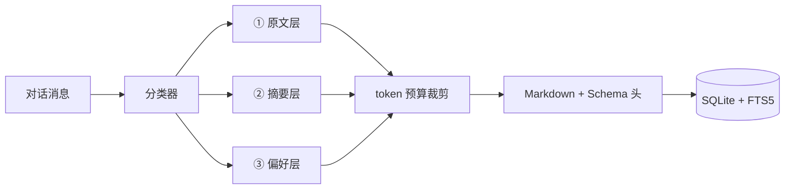

# DialogueContextBridge · 对话上下文桥接

> **为大语言模型（LLM）与 AI 智能体的对话会话做跨会话上下文桥接。**
>
> 把一次对话里「已经了解的信息」打包成可移植的知识单元，一键引入新对话，让 AI 不必反复从头了解背景。

<p>
  
</p>

| 资源 | 链接 |
| --- | --- |
| 📖 文档站点 | [shadowquill.github.io/DialogueContextBridge](https://shadowquill.github.io/DialogueContextBridge/) |
| 架构设计 | [docs/architecture.md](https://github.com/ShadowQuill/DialogueContextBridge/blob/main/docs/architecture.md) |
| 快照格式 | [docs/snapshot-schema.md](https://github.com/ShadowQuill/DialogueContextBridge/blob/main/docs/snapshot-schema.md) |
| 宿主联调 | [docs/dsh-host-integration.md](https://github.com/ShadowQuill/DialogueContextBridge/blob/main/docs/dsh-host-integration.md) |

[](https://github.com/ShadowQuill/DialogueContextBridge/actions/workflows/ci.yml)
[](https://github.com/ShadowQuill/DialogueContextBridge/actions/workflows/deploy-docs.yml)
[](./LICENSE)
[](https://shadowquill.github.io/DialogueContextBridge/)

## 这是什么

做长周期项目（软件开发、学术研究、产品设计）时，你和大语言模型（LLM）/ AI 智能体的工作往往跨越多个对话会话。每开一个新对话，模型都「失忆」，要重新解释一遍背景，于是出现三个老问题：

- **效率低**：反复手动复制粘贴历史上下文；
- **信息丢**：关键决策、代码、参数在摘要里被磨平；
- **体验断**：长期项目的连续性被会话边界切断。

DialogueContextBridge 是一个 **DSH（DeepSeek Harness，一个面向大语言模型的智能体运行时）插件**，用「对话上下文快照」解决这件事：在源对话里 `/compile` + `/save`，在新对话里一键引入，AI 立刻拿到你们此前达成的全部共识。

所有数据只存在本机 `~/.dsh/`，不上传任何服务器；快照是纯文本 Markdown，任何能读文本的 Agent 都能接手。

## 核心设计：三层快照

快照不是对话日志的转储，而是一个结构化的三层复合体。

| 层 | 内容 | 处理策略 |
| --- | --- | --- |
| **① 关键消息原文** | 最终敲定的代码、决策结论、技术参数、硬性指令 | **逐字保留**，禁止压缩与截断 |
| **② 结构化摘要** | 讨论背景、推导过程、中间试错、已排除方案 | 由 `/compile` 压缩为分层要点 |
| **③ 用户偏好与设定** | 风格偏好、角色设定、项目硬性约束 | 按稳定 `key` 归档，便于跨快照裁决 |

这个分层是为了解决「摘要损失」：把不可压缩的东西和可压缩的东西分开处理，而不是对整段对话做一次无差别摘要。




## 快速开始

### 环境要求

- Node.js ≥ 18.17
- 一个基于 Cordis 的 DSH 运行时
- SQLite ≥ 3.34（用于 FTS5 `trigram` 分词器，中文检索依赖它；低版本会自动回退到 `unicode61`）

### 安装

```bash
# 在 DSH 工作目录中安装
npm install dsh-plugin-dialogue-context-bridge
```

### 启用插件

在 DSH 配置中加载插件，或在设置面板中搜索「对话上下文桥接」启用：

```ts
import bridge from 'dsh-plugin-dialogue-context-bridge';

ctx.plugin(bridge, {
  maxTokens: 4096,
  autoSave: false,
});
```

### 三条命令跑通闭环

```bash
# 1. 把当前对话编译为快照草稿（只在内存中，不写盘）
/compile --title "上下文桥接架构评审" --tags 架构,phase1

# 2. 确认无误后落库
/save

# 3. 在任何时候按关键词找回它
/snapshot-search 上下文桥接

# 4. 在新对话里一键引入——默认「仅新信息」模式（只读背景，不回写）
/import snap_a1b2c3

#    想让当前对话与历史快照融合？用 merge 模式（Phase 3 基线）
/import snap_a1b2c3 --mode merge

#    只看简报、不注入，先确认内容对不对
/import snap_a1b2c3 --dry-run
```

## 命令参考

| 命令 | 说明 | 常用选项 |
| --- | --- | --- |
| `/compile` | 编译当前对话为三层快照草稿并预览 | `--title` `--tags` `--max-tokens` `--full` `--discard` |
| `/save` | 把草稿写入本地记忆库；无草稿时即时编译并保存 | `--title` `--tags` `--max-tokens` |
| `/snapshot-search <keywords>` | FTS5 全文检索（多关键词为 AND 语义） | `-n, --limit` |
| `/snapshot-list` | 列出快照 | `-n, --limit` `--here` |
| `/snapshot-show <id>` | 查看快照完整文档与完整性校验结果 | `--meta` |
| `/snapshot-remove <id>` | 删除快照及其索引（不可撤销） | — |
| `/snapshot-history <id>` | 查看快照版本历史（Phase 4 版本控制） | — |
| `/snapshot-rollback <id>` | 回滚快照到历史版本并重新落库 | `--to <ref>` |
| `/import <id>` | 把历史快照引入当前对话：默认「仅新信息」，亦可「合并」 | `--mode inject\|merge` `--policy snapshotWins\|newWins\|timestamp` `-d, --dry-run` |
| `/dcb <id>` | 一键引入快照（等价 `/import <id>` 的 inject 模式） | — |

`/compile` 与 `/save` 是有意分开的两步：快照一旦落库就可能被其他对话引入，必须由你确认内容后再持久化。若你更喜欢一步到位，把配置项 `autoSave` 打开即可。

## 配置项

在 DSH 设置面板中可热改，无需重启。

| 配置项 | 默认值 | 说明 |
| --- | --- | --- |
| `dataDir` | `dialogue-context-bridge` | 数据目录，相对路径挂在 `~/.dsh` 下 |
| `maxTokens` | `4096` | 单个快照的 token 上限，可扩展至 8192 |
| `maxBulletsPerSection` | `6` | 摘要每小节保留的最大要点数 |
| `maxHistoryMessages` | `400` | `/compile` 单次读取的消息上限 |
| `autoSave` | `false` | `/compile` 后是否自动落库 |
| `searchLimit` | `10` | 检索默认返回条数 |
| `encryption.enabled` | `false` | 启用 AES-256-GCM 静态加密 |
| `encryption.passphrase` | `''` | 加密口令（≥ 8 位，不落盘） |
| `encryption.indexPlaintext` | `false` | 加密时是否仍建明文索引（**默认关闭**，开启会通过索引泄漏内容） |
| `logLevel` | `info` | 日志级别 |
| `merge.policy` | `newWins` | 合并模式（`/import --mode merge`）的冲突裁决规则：`newWins` 当前对话覆盖历史快照、`snapshotWins` 历史快照优先、`timestamp` 按时间戳先后 |
| `versioning.enabled` | `false` | 记忆库版本控制：每次保存/删除快照后自动 `git` 提交（数据目录下 `snapshots/` 子目录即仓库），并可用 `/snapshot-rollback` 回滚。**注意**：被版本化的是快照 Markdown 明文，git 历史不加密 |

### 关于加密擦除

口令不落盘。丢弃口令即等价于销毁全部密文（cryptographic erasure）——这也意味着**口令丢失后快照无法恢复**，请自行妥善保管。

## 项目结构

```
DialogueContextBridge/
├── src/
│   ├── index.ts              # Cordis 插件入口（apply / 服务注册 / 生命周期）
│   ├── config.ts             # schemastery 配置 Schema
│   ├── service.ts            # 编译→预览→落库→检索的编排层
│   ├── types.ts              # 三层快照数据模型
│   ├── commands/             # 命令层（/compile、/save、/snapshot-*）
│   │   ├── compile.ts
│   │   ├── save.ts
│   │   ├── search.ts
│   │   ├── manage.ts
│   │   ├── format.ts         # 面向用户的输出渲染
│   │   └── shared.ts         # 选项解析与错误包装
│   ├── core/                 # 与宿主解耦的纯逻辑
│   │   ├── lexicon.ts        # 语义识别词典（可扩展）
│   │   ├── classifier.ts     # 消息 → 三层分类
│   │   ├── summarize.ts      # 摘要器（内置抽取式，可注入 LLM 实现）
│   │   ├── budget.ts         # token 预算裁剪
│   │   ├── serializer.ts     # Markdown + Schema 头 序列化/解析
│   │   └── compiler.ts       # /compile 的完整流水线
│   ├── storage/              # SQLite + FTS5
│   │   ├── database.ts
│   │   ├── migrations.ts
│   │   └── repository.ts
│   ├── security/crypto.ts    # AES-256-GCM 封装
│   ├── dsh/types.ts          # 宿主能力的类型接缝
│   └── utils/                # id / token 估算 / 路径 / 日志
├── tests/                    # vitest 单元测试
└── docs/
    ├── architecture.md       # 架构与设计决策
    └── snapshot-schema.md    # 快照文档格式规范
```

## 开发指南

```bash
npm install          # 安装依赖
npm run dev          # tsup 监听构建
npm run typecheck    # 类型检查
npm run lint         # ESLint（Airbnb TypeScript 风格）
npm test             # vitest
npm run test:coverage
npm run build        # 产出 lib/（esm + cjs + d.ts）
```

### 代码约定

- **风格**：Airbnb TypeScript 风格指南，由 ESLint + Prettier 强制；
- **注释**：所有公开函数、接口必须有完整 JSDoc（含 `@param` / `@returns`）；
- **范式**：优先函数式，用工厂函数替代 class（ESLint 规则会拦住 `class` 声明）；
- **提交**：遵循 [Conventional Commits](https://www.conventionalcommits.org/)，由 commitlint 校验。

```bash
feat(core): 支持按标签过滤快照检索
fix(storage): 修正 trigram 短词回退时的空结果
docs(readme): 补充加密擦除说明
```

`type` 允许 `feat|fix|docs|style|refactor|perf|test|build|ci|chore|revert`；`scope` 建议使用 `core|storage|security|commands|dsh|config|docs|deps|release`。

### 单元测试的边界

`src/core`、`src/storage`、`src/security` 全部可在纯 Node 环境下测试，不需要启动 DSH。宿主相关的耦合被收敛在 `src/dsh/types.ts` 这一个文件里——若 DSH 的命令/对话 API 与此处声明不同，只需改这一处适配。

## 路线图

- [x] **Phase 1** 快照导出：三层编译、Markdown + Schema 落盘、FTS5 检索
- [x] **Phase 2** 快照导入：「仅了解新引入信息」模式（快照作为只读背景情报注入，`/import` + `InjectionService` 宿主接缝）
- [x] **Phase 3** 合并模式：当前上下文与引入快照智能融合，偏好层按可配置规则裁决（`newWins` / `snapshotWins` / `timestamp`），冲突清单写入「裁决报告」供复核（`/import --mode merge [--policy ...]`，`merge.policy` 配置项）
- [x] **Phase 4** 记忆库版本控制：每次保存/删除自动 `git` 提交（数据目录 `snapshots/` 即仓库），`/snapshot-history` + `/snapshot-rollback` 可回滚到历史版本；设置面板经 Schemastery 热改集成；`/dcb <id>` 提供一键导入快捷入口

## License

[MIT](./LICENSE)
